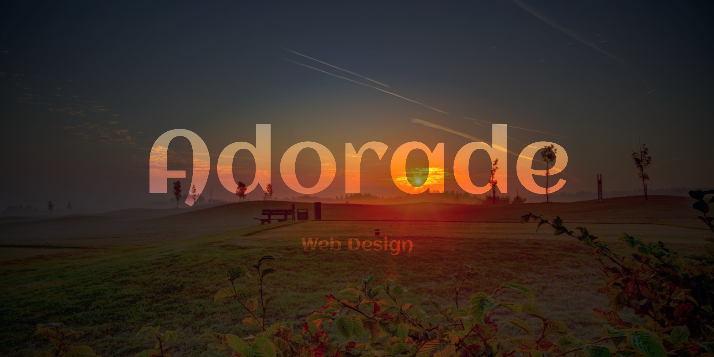

# Adorade 

This is the [website](https://adorade.ro/) of the project.

> Once upon a time, we started a journey, to discover... to learn beautiful things.

## Build Tools

This project have some requirements you need to meet in order to compile it.

* [Node.js](https://nodejs.org/)
* [Yarn](https://yarnpkg.com/en/)
* [Gulp](http://gulpjs.com/)

## License

See the [LICENSE](LICENSE) file for license rights and limitations (MIT).
