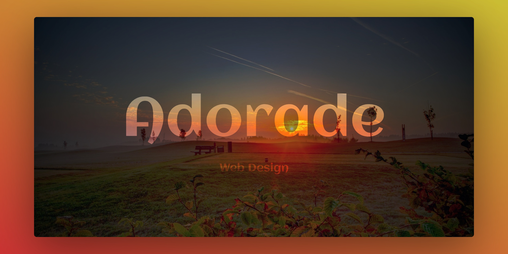

# Adorade

This is the [website](https://adorade.ro/) of the project.

> Once upon a time, we started a journey, to discover... to learn beautiful things.

## License

See the [LICENSE](LICENSE) file for license rights and limitations (MIT).
